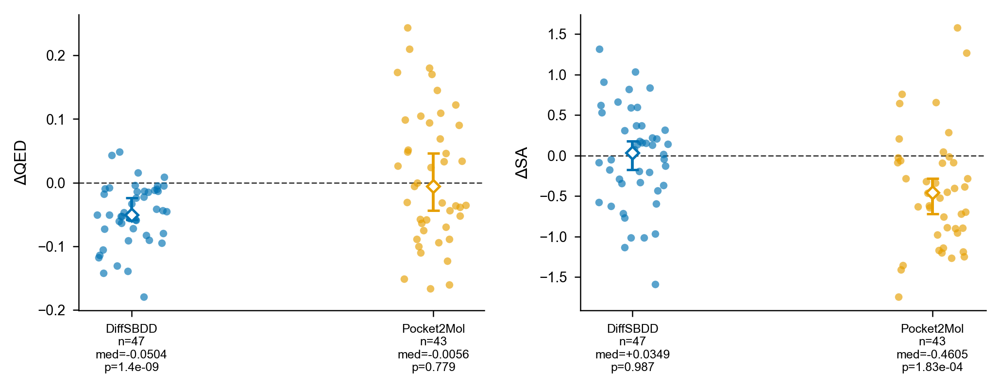
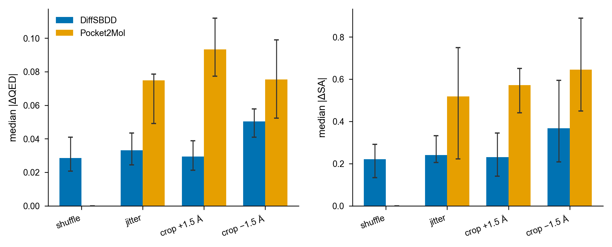
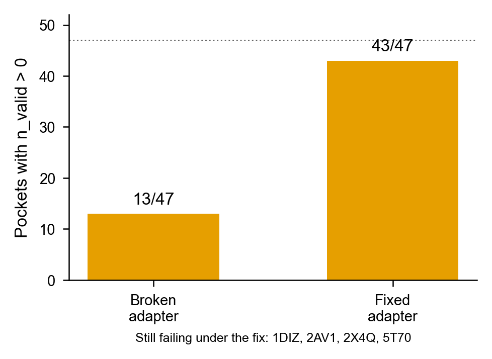

# PocketBench

Does an SBDD generator still make the same molecules if you cut the pocket a little differently?

**PocketBench** checks that. It compares two kinds of input change:

- **Featurization noise** — shuffle atom order, or jiggle coordinates by a fraction of an Å. The atom set stays the same.
- **Pocket boundary** — grow or shrink the crop by 1.5 Å. Residues enter or leave.

On 47 matched complexes, DiffSBDD and Pocket2Mol do **not** shift QED or SA under noise. They **do** shift when the crop changes — and not on the same metric.

| When the pocket shrinks 1.5 Å | DiffSBDD | Pocket2Mol |
|---|---|---|
| Drug-likeness (QED) | drops (−0.050) | no signed shift |
| Synthesizability (SA) | no signed shift | drops (−0.46) |
| Mass | no signed shift | lighter (−23 Da) |

A soft cutoff and crop-radius training did **not** fix DiffSBDD’s QED drop (locked Null). Coverage for Pocket2Mol was mostly a file-format bug: **13/47 → 43/47** after the adapter fix.

## Results

**Same tighter crop, different chemistry.** DiffSBDD loses QED; Pocket2Mol loses SA.



**Crop changes are larger than shuffle or jitter.**



**Most “the model failed” was the harness.**



Predicted affinity barely moves once the receptor is held fixed (molecule-attributable Vina +0.05 kcal/mol). Mass does not explain the QED drop. The residues that leave are a polar second shell — not the crystal contact set.

## Score a model (no GPU)

```bash
pip install -e .
pocketbench report --metrics my_model_metrics.csv --out-dir my_report
```

CSV: one row per pocket × condition. Need `pocket_id`, `perturbation_tag`, `mean_qed`. Tags: `original`, `atom_shuffle`, `coordinate_jitter`, `crop_radius_plus_1.5`, `crop_radius_minus_1.5`.

```bash
python -m sbdd_robust run --config configs/examples/smoke.yaml
```

MIT. PocketBench does not ship model weights. If you run DiffSBDD or Pocket2Mol, cite those papers too.
